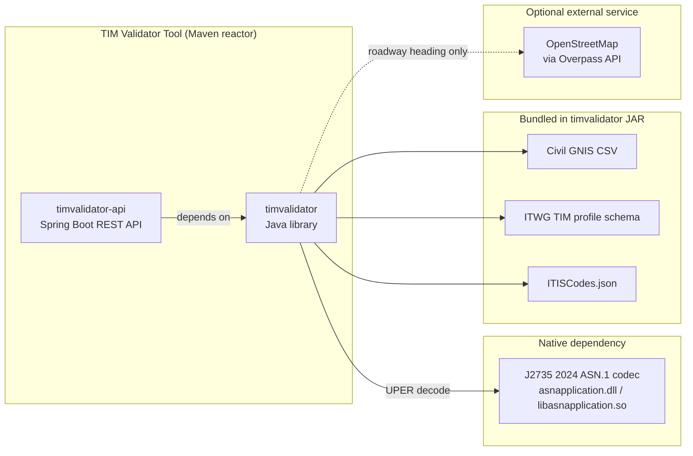
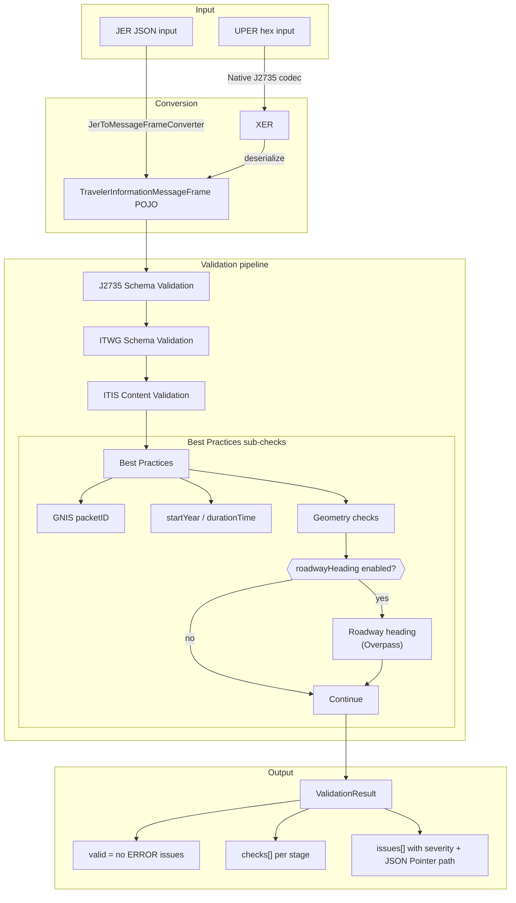
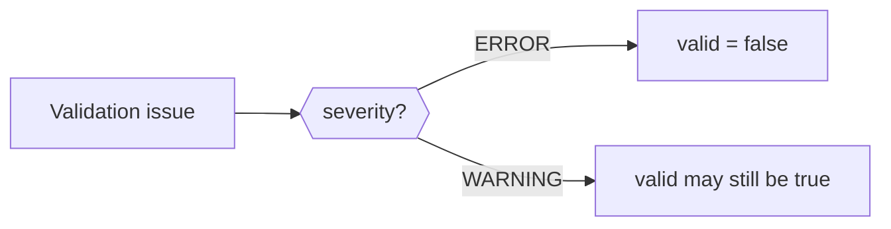

# TIM Validation Pipeline

This document describes how TIM Validator Tool processes a message from input to
response. It complements the behavioral detail in
[validation-checks.md](validation-checks.md), the schema comparison in
[j2735-vs-itwg-schema.md](j2735-vs-itwg-schema.md), and the ITWG traceability
matrix in [itwg-requirement-coverage.md](itwg-requirement-coverage.md).

## Module architecture

The repository is a Maven aggregator with two modules that build together:



| Module | Role |
|---|---|
| `timvalidator` | Core validation library. Published as `com.neaeraconsulting:timvalidator`. |
| `timvalidator-api` | Thin HTTP wrapper over `TimValidationService`. Exposes JER and UPER endpoints. |

The library is the primary product. The API is one deployment option for operators
who want to validate messages without embedding the library.

## Validation pipeline

Both input formats deserialize to the same `TravelerInformationMessageFrame` POJO
before entering the shared validation pipeline.



### Input conversion

| Format | Entry point | Conversion path |
|---|---|---|
| JER JSON | `validateTimJer()` | JSON → POJO via `JerToMessageFrameConverter` |
| UPER hex | `validateTim()` | UPER → XER → POJO via native codec |

At the library level, conversion failures such as malformed JSON, invalid UPER,
or codec errors abort the pipeline before schema validation and produce a
`Validation Pipeline` error. At the REST API boundary, malformed JSON is
rejected before the library is called and returns `400 Bad Request`; a
parseable request whose TIM conversion fails returns `200 OK` with
`valid: false` and a `Validation Pipeline` issue.

### Validation stages

All four stages run for every successfully deserialized message. An earlier stage
failure does not skip later stages.

| Stage | `checks[]` name | Blocking? | Summary |
|---|---|---|---|
| 1 | `J2735 Schema Validation` | Yes — schema errors are `ERROR` issues | Generated J2735 TIM MessageFrame JSON Schema. |
| 2 | `ITWG Schema Validation` | Yes — schema errors are `ERROR` issues | Stricter ITWG TIM profile overlay. See [j2735-vs-itwg-schema.md](j2735-vs-itwg-schema.md). |
| 3 | `ITIS Content Validation` | Pattern violations are `ERROR`; skipped frames produce `WARNING` | Advisory ITIS code sequences validated against `ITISCodes.json`. |
| 4 | `Best Practices` | Mixed — see [validation-checks.md](validation-checks.md) | Time, GNIS `packetID`, geometry, and optional roadway-heading checks. Validator-level failures are reported as `Best Practices Validation`. |

The ITIS stage reports `passed: true` when validation completes with no pattern
errors, including when it collects non-blocking warnings. A pattern violation
produces an `ERROR` issue and records the stage as `passed: false`.

The Best Practices stage reports `passed: false` when returned best-practice
issues contain an `ERROR`; warnings alone leave `passed: true`. If a best-practice
validator throws before returning its issue list, the service records a separate
`Best Practices Validation` failure and may also retain the empty `Best Practices`
result.

## Severity and overall validity



- `valid` is `true` when the `issues` list contains no `ERROR`-severity entries.
- `WARNING` issues do not fail validation.
- Each issue includes `severity`, `checkName`, `message`, and a JSON Pointer
  `path` when the validator can identify one.
- `checks[]` summarizes each stage independently. A stage can show `passed: true`
  while still contributing warnings to `issues[]`.

## Network boundaries

By default, validation is fully network-free:

- J2735 and ITWG schema validation use bundled schemas.
- GNIS `packetID` checks use the packaged Civil GNIS CSV.
- Geometry checks use in-memory JTS operations.

The only stage that may use the network is the optional roadway-heading check
inside Best Practices geometry validation. It queries OpenStreetMap through the
Overpass API when `ValidationOptions.withRoadwayHeading()` is enabled (or when
the API receives `?roadwayHeading=true`).

The library has no default Overpass endpoint or User-Agent. The API module
defaults to the public Overpass instance but remains network-free unless roadway
heading is explicitly enabled. See [validation-checks.md](validation-checks.md)
for configuration details.

## Example payloads

The repository includes JER MessageFrame fixtures under
`timvalidator/src/test/resources/fixtures/`. They are useful starting points for
manual testing with the library or API.

### Full-pipeline-valid examples

These fixtures pass the J2735 schema, ITWG schema, ITIS content, and local
best-practice checks when roadway-heading validation is disabled.

| Fixture | Description |
|---|---|
| [valid-circle-tim.json](../timvalidator/src/test/resources/fixtures/itwg/valid-circle-tim.json) | Circle geometry region with ITWG-required fields. |
| [valid-closed-path-tim.json](../timvalidator/src/test/resources/fixtures/itwg/valid-closed-path-tim.json) | Closed polygon path (`closedPath: true`). |

Validate with the API:

```bash
# Run this command from the repository root while the API is running.
curl -sS -X POST http://localhost:8080/api/v1/tim/validate/jer \
  -H "Content-Type: application/json" \
  --data-binary @timvalidator/src/test/resources/fixtures/itwg/valid-circle-tim.json
```

### GNIS and geometry examples

| Fixture | Description |
|---|---|
| [SingleRegionCircleTIM.json](../timvalidator/src/test/resources/fixtures/gnis/SingleRegionCircleTIM.json) | Single-region circle TIM with a real `packetID` prefix. |
| [SingleRegionPathOffsetTIM.json](../timvalidator/src/test/resources/fixtures/gnis/SingleRegionPathOffsetTIM.json) | Open path with XY offset nodes. |
| [ClosedPathTim.json](../timvalidator/src/test/resources/fixtures/gnis/ClosedPathTim.json) | Closed polygon path for geometry checks. |
| [MultiRegionPathOffsetTIM.json](../timvalidator/src/test/resources/fixtures/gnis/MultiRegionPathOffsetTIM.json) | Multiple regions with offset-encoded paths. |
| [MultiDataFrameOffsetTim.json](../timvalidator/src/test/resources/fixtures/gnis/MultiDataFrameOffsetTim.json) | Multiple data frames with offset paths. |

These fixtures are used in focused GNIS and geometry unit tests. They predate
the complete ITWG profile and may fail schema or ITIS validation when sent
through the full service. Use the full-pipeline fixtures above when you need a
message that should pass the current default validation flow.

## Related documentation

- [Documentation index](README.md)
- [Validation checks](validation-checks.md) — time, GNIS, geometry, and roadway-heading behavior
- [J2735 vs ITWG schema](j2735-vs-itwg-schema.md) — schema differences enforced in stages 1 and 2
- [ITWG requirement coverage](itwg-requirement-coverage.md) — requirement-by-requirement status
- [Civil GNIS deployment areas](civil_gnis_deployment_areas.md) — bundled GNIS dataset
- [API README](../timvalidator-api/README.md) — REST endpoints and response format
